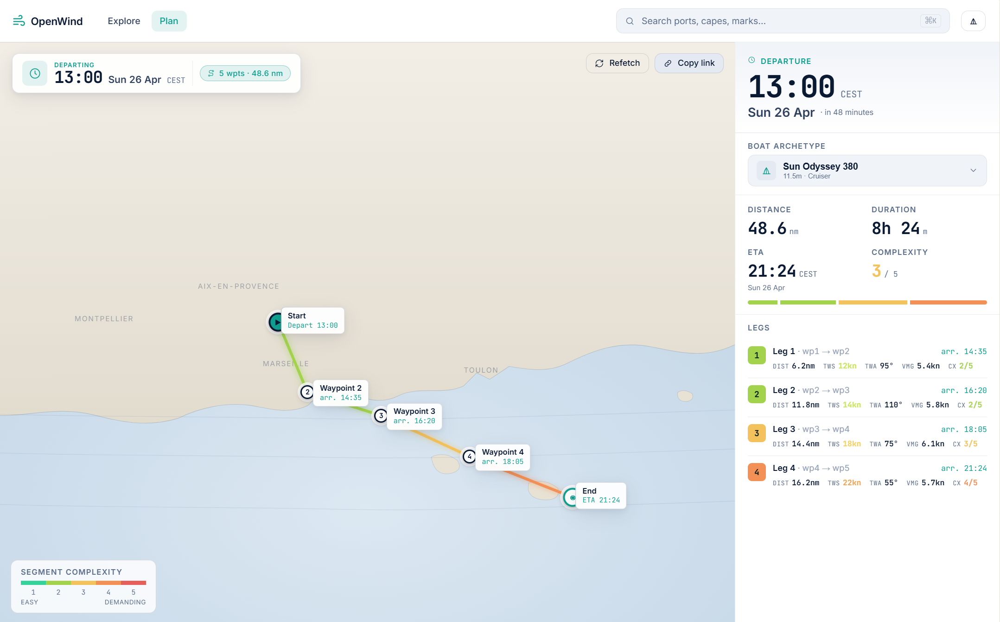

# OpenWind ⛵

> **Talk to your LLM. Cast off with confidence.**
>
> OpenWind turns any MCP-capable assistant Claude, Le Chat, Cursor, Goose,
> Zed, Continue into a Mediterranean passage planner. Ask in plain
> language. Get a per-leg ETA, a 1‑5 complexity score, and a deep-link to
> the full plan. Free, keyless, open source.

[**openwind.fr**](https://openwind.fr) · [`mcp.openwind.fr`](https://qdonnars-openwind-mcp.hf.space/) · MIT



---

## Try it in 30 seconds

**1.** Open your MCP client and add the endpoint:

```
https://qdonnars-openwind-mcp.hf.space/mcp
```

**2.** Ask, in your own words:

> *"Demain matin, Marseille → Porquerolles, sur un Sun Odyssey 36. Bonne
> idée ? Combien de temps et c'est tendu comment ?"*

**3.** Your assistant calls the OpenWind tools and answers in plain language.
On hosts that support the [MCP Apps spec](https://modelcontextprotocol.io/extensions/client-matrix)
(Claude, Claude Desktop, ChatGPT, VS Code Copilot, Goose, Postman, MCPJam) you
also get a live, interactive widget the [openwind.fr](https://openwind.fr)
plan view rendered inline. On hosts that don't (Cursor, Le Chat, terminal),
the assistant hands you the same plan as a [openwind.fr](https://openwind.fr)
deep-link. No account. No API key. No credit card.

> **First time with MCP?** It takes 2 minutes. Pick your client on
> [modelcontextprotocol.io/clients](https://modelcontextprotocol.io/clients),
> then follow the
> [remote-server quickstart](https://modelcontextprotocol.io/docs/develop/connect-remote-servers).
> Claude Desktop users can start with the
> [user quickstart](https://modelcontextprotocol.io/quickstart/user).

## Why OpenWind

|                              |                                                                                              |
|------------------------------|----------------------------------------------------------------------------------------------|
| 🆓 **Free, keyless**         | Wind & sea via [Open-Meteo](https://open-meteo.com) (CC BY 4.0). No account, no API key.     |
| 🌊 **Mediterranean-tuned**   | Defaults to AROME 1.3 km catches thermals, mistral, tramontane. Falls back to ICON-EU → ECMWF → GFS as the horizon stretches out. |
| ⛵ **Boat-aware**             | Five archetypes from racer-cruiser to bluewater, real polars, an `efficiency` parameter for trim and crew level. |
| 🗓️ **Window-aware**           | One call sweeps a 14-day departure range and lets your LLM pick the calmest weekend slot no math by hand. |
| 🔌 **Client-agnostic**        | One HTTP MCP endpoint. Works in Claude Desktop, Le Chat, Cursor, Goose, Zed, Continue, …     |
| 🖼️ **Rich on supporting hosts** | On Claude / ChatGPT / VS Code Copilot / Goose, an interactive widget renders inline via [MCP Apps](https://modelcontextprotocol.io/extensions/client-matrix). Other hosts fall back to a clean text summary + deep-link. |
| 🛠️ **Open source, MIT**       | Self-host on Fly, Modal, your VPS `mcp-core` is deployment-agnostic. The HF Space is one wrapper among many. |

## What the LLM sees

Four MCP tools, all async, all keyless:

| Tool                      | What it does                                                              |
|---------------------------|---------------------------------------------------------------------------|
| `list_boat_archetypes`    | Five descriptive archetypes; the LLM maps "Sun Odyssey 36" → `cruiser_30ft` itself. |
| `get_marine_forecast`     | Wind + sea around a point/window, multi-model.                            |
| `plan_passage`            | End-to-end: per-leg timing + 1‑5 complexity + openwind.fr deep-link, in one call. Pass `latest_departure` to compare every hourly window up to 14 days out the LLM picks the calmest slot. |
| `read_me`                 | Returns OpenWind's calculation methodology call when the user asks how things are computed. |

`plan_passage` declares an MCP Apps UI resource (`ui://openwind/plan-passage`)
on its `_meta`. Hosts that support [MCP Apps](https://modelcontextprotocol.io/extensions/client-matrix)
render the live `openwind.fr/plan?…` view in a sandboxed iframe automatically
  no host-specific CSS, no vendor lock-in. Hosts without MCP Apps support
silently get the structured payload + the `openwind_url` deep-link.

## Architecture

```
packages/
├── data-adapters/   # pure domain logic (forecast adapters, polars, routing, complexity)
├── mcp-core/        # FastMCP server (cloud-agnostic, no Gradio, no HF deps)
├── hf-space/        # ~20-line Docker wrapper for Hugging Face Spaces
└── web/             # React 19 + Vite app deployed to GitHub Pages (openwind.fr)
```

`mcp-core` stays deployment-agnostic. Re-deploying on Fly, Modal, or a VPS is
a different `Dockerfile` calling the same `build_server()`. See
[docs/architecture.md](docs/architecture.md).

## Run locally

```bash
# Tests + lint (data-adapters & mcp-core, Python via uv)
cd packages/mcp-core
uv sync --all-extras
uv run pytest -x -q
uv run ruff check .

# Local HTTP MCP smoke
cd packages/hf-space
uv run python app.py   # serves :7860, point any MCP client at /mcp

# Web app (openwind.fr)
cd packages/web
npm install
npm run dev            # vite dev server
npm run build          # outputs packages/web/dist
```

## V1 scope

Wind, sea (`Hs` max), per-leg ETA, 1–5 complexity. Tides and currents ignored
on the Med (negligible). No automatic routing optimisation the LLM and the
human stay in the loop. Roadmap and scope decisions live in
[`plan/`](plan/) (local).

## Calculation method

Defaults below are what the MCP server uses unless overridden by tool parameters.
Implementation: [`packages/data-adapters/src/openwind_data/routing/passage.py`](packages/data-adapters/src/openwind_data/routing/passage.py).

### Polar speed model

- 5 archetypes (`cruiser_30ft`, `cruiser_40ft`, `cruiser_50ft`, `racer_cruiser`, `catamaran_40ft`), each with an ORC-style polar in [`packages/data-adapters/src/openwind_data/routing/polars/`](packages/data-adapters/src/openwind_data/routing/polars/).
- Lookup is **bilinear interpolation** in (TWS, TWA), clamped at grid edges.
- TWA is symmetric `[0°, 180°]` only, no port/starboard distinction.

### Boat speed adjustments

- **Efficiency factor (default 0.75)** ORC polars are theoretical maxima. Real cruising loses ~25% (sail trim, comfort margins, helmsman, untracked currents). Override per call: `0.85` racing, `0.75` cruising, `0.65` loaded family cruising, `0.55` heavy seas / fouled hull.
- **VMG / tacking correction** when the route's TWA is below the boat's optimal upwind angle (typically ~42-48°), the simulator assumes the sailor tacks. Effective speed toward destination is `polar(optimal_TWA) × cos(optimal_TWA − route_TWA)`. At dead upwind this reduces to `polar(opt) × cos(opt) ≈ polar / √2`; at TWA=20° with opt=45° the reduction is only `cos(25°) ≈ 0.91`.
- **Wave derate (opt-in)** `max(0.5, 1 − 0.05 × Hs^1.75 × cos²(TWA/2))`. Disabled by default sea state feeds the warning bar rather than slowing the boat.
- **Minimum boat speed** 0.5 kn floor, prevents division blow-up in extreme stalls.

### Timing

- **Single-pass approximation** a 6 kn heuristic estimates segment mid-times, then real polar speeds are computed at each mid-time's actual wind. No convergence iteration. Bias is bounded by the Mediterranean's multi-hour wind correlation length.
- Routes are split into ~10 nm sub-segments by default for per-segment weather sampling. Drop to 5 nm for tight coastal work; raise to 20 nm for long offshore legs.

### Compare-windows mode

`plan_passage` accepts an optional `latest_departure` that turns the call into a window comparison: it walks N hourly departures over the same route and returns one entry per window. Weather is fetched once (cache prewarm), simulations are in-memory. Hard cap: 14 d × 24 h = 336 windows. The LLM (not the server) picks the best option qualitatively.

### Mediterranean defaults

- **Tides ignored** < 40 cm in the Med, negligible vs. forecast uncertainty.
- **Currents ignored** Liguro-Provençal current too weak / variable for V1.
- **Wind model** AROME 1.3 km (≤48 h horizon, captures thermals and local winds). Auto-falls back to ICON-EU (≤5 d) → ECMWF IFS 0.25° (≤10 d) → GFS (≤16 d) when the passage extends past AROME.
- **Wave model** Open-Meteo Marine (significant Hs, period, direction).

### What's not modelled (V1)

- No automatic routing optimisation the LLM and human stay in the loop on departure choice.
- No coastal acceleration zones (capes, peninsulas) caller adds intermediate waypoints.
- No port/starboard polar asymmetry, no spinnaker-specific curves, no hull condition modelling beyond the `efficiency` knob.

## Credits

Wind & sea: [Open-Meteo](https://open-meteo.com/) (CC BY 4.0). Hosting:
[Hugging Face Spaces](https://huggingface.co/spaces). Map tiles on
[openwind.fr](https://openwind.fr): [CARTO](https://carto.com/) /
[OpenStreetMap](https://www.openstreetmap.org/copyright).

## License

[MIT](LICENSE).
