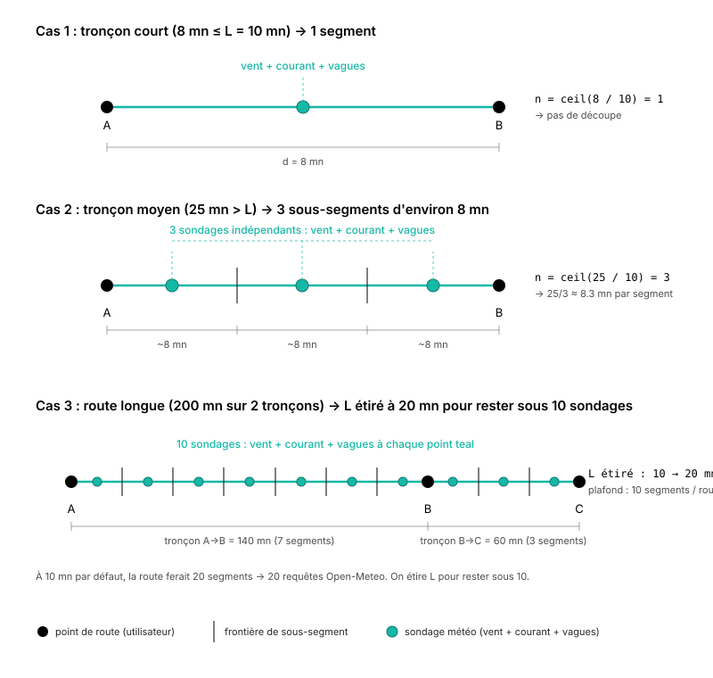

# Methodology

*This page is an English translation of the French original ([méthodologie](/methodologie)), which remains the reference version.*

OhMyWind is an open source sailing passage planner, usable anywhere in the world, with enhanced accuracy along the French Atlantic coast. This page explains where the data comes from, how a passage is estimated, and what the tool deliberately does not try to do.

## Contents

- [The data sources](#the-data-sources)
  - [Wind: multi-model cascade](#wind-multi-model-cascade)
  - [Waves and sea level](#waves-and-sea-level)
  - [Currents: the global SMOC product](#currents-the-global-smoc-product)
  - [High-precision coastal currents: SHOM Atlas C2D and MARC PREVIMER](#high-precision-coastal-currents-shom-atlas-c2d-and-marc-previmer)
- [How a passage is estimated](#how-a-passage-is-estimated)
  - [1. Choosing the reference boat](#1-choosing-the-reference-boat)
  - [2. Splitting the route](#2-splitting-the-route)
  - [3. Wind at the middle of each sub-segment](#3-wind-at-the-middle-of-each-sub-segment)
  - [4. Polar, wind angle and upwind tactics](#4-polar-wind-angle-and-upwind-tactics)
  - [5. Speed through the water (STW)](#5-speed-through-the-water-stw-efficiency-and-the-wave-reduction)
  - [6. Speed over the ground (SOG), current and duration](#6-speed-over-the-ground-sog-current-and-duration)
- [How the current is derived at a MARC point](#how-the-current-is-derived-at-a-marc-point)
- [How complexity is rated](#how-complexity-is-rated)
- [The conventions of the domain](#the-conventions-of-the-domain)
- [What OhMyWind does not do](#what-ohmywind-does-not-do)
- [Sources and licences](#sources-and-licences)
- [Hosting](#hosting)
- [Code and contributions](#code-and-contributions)

## The data sources

### Wind: multi-model cascade

Every wind forecast comes through the **Open-Meteo Forecast API** (API = Application Programming Interface), with no access key, following a cascade by forecast horizon:

- **AROME** (Application of Research to Operations at Mesoscale, Météo-France, 1.3 km), a high-resolution model over the French Atlantic coast and the Mediterranean, out to about 48 h. It is the one that captures thermal winds, the strengthening around headlands and local effects.
- **ICON-EU** (Icosahedral Nonhydrostatic, DWD = Deutscher Wetterdienst, the German weather service, 7 km) takes over out to 5 days.
- **ECMWF IFS** (European Centre for Medium-Range Weather Forecasts, Integrated Forecasting System, 25 km) covers the 10-day horizon.
- **GFS** (Global Forecast System, NOAA = National Oceanic and Atmospheric Administration, the American ocean and atmosphere agency, 25 km) acts as a safety net out to 16 days.

Speeds always in knots. Directions always in the meteorological **TWD** convention (True Wind Direction, "where the wind is coming from").

### Waves and sea level

**Open-Meteo Marine API**, a keyless redistribution of the WaveWatch III wave model (NOAA) and of the Copernicus model for sea level:

- Height, period and direction of the total sea, plus the split into wind waves and swell.
- Sea level relative to MSL (Mean Sea Level), signed values.

Enough for open-water planning and for most of the Mediterranean.

### Currents: the global SMOC product

Currents come from the **SMOC product** (Surface Merged Ocean Currents) distributed by the Copernicus Marine Service and exposed through Open-Meteo. SMOC is a physical sum of three components computed at 1/12° resolution (about 8 km):

- The tidal stream predicted by harmonic modelling.
- The general circulation (from the global Mercator NEMO model = Nucleus for European Modelling of the Ocean, at 1/12°, assimilating satellite SST (Sea Surface Temperature), altimetry and Argo floats).
- The Stokes drift induced by the waves.

Academic reference: **Lellouche, J.-M. et al. (2018)**. *Recent updates to the Copernicus Marine Service global ocean monitoring and forecasting real-time 1/12° high-resolution system*. Ocean Science, 14, 1093 to 1126. [doi.org/10.5194/os-14-1093-2018](https://doi.org/10.5194/os-14-1093-2018)

A limitation we accept: 8 km is enough offshore but stays too coarse for the narrow passes of the French Atlantic coast, where we switch to the MARC atlases described below.

### High-precision coastal currents: SHOM Atlas C2D and MARC PREVIMER

For the critical passes of the Atlantic seaboard, OhMyWind does not settle for SMOC at 8 km. The current cascade stacks three sources, from the finest to the broadest:

**1. SHOM Atlas C2D: the SHOM reference (Service Hydrographique et Océanographique de la Marine, the French naval hydrographic office).** The C2D atlases gather the tidal streams of the French coast (Channel and Atlantic) as scattered points placed by hand by hydrographers along the flow axes of the navigational passes. 2005 edition, 9 atlases (557 Pas de Calais, 558 Bretagne sud, 559 Vendée-Gironde, 560 Iroise / Brest, 561 Baie de Seine, 562 Golfe Normand-Breton, 563 Bretagne nord, 564 Manche, 565 Gascogne), about 13,000 points in total. Coverage is not continuous: these are insets centred on areas of nautical interest (Goulet de Brest, Rade de Brest, Raz de Sein, Goulet du Morbihan, Quiberon, Saint-Malo, Hague, and so on). Distributed by data.gouv.fr under Licence Ouverte v2.0 Etalab. At each point, two hourly series of 13 U/V values (east-west and north-south components) are stored, one for springs (coefficient 95), the other for neaps (coefficient 45), for hours from -6 h to +6 h relative to high water (or low water) at the reference port for the area (Port-Navalo, Brest, Saint-Malo and so on).

**2. MARC PREVIMER (Modélisation et Analyse pour la Recherche Côtière, Ifremer + SHOM).** Continuous harmonic atlases on a regular grid, which complete SHOM C2D wherever its insets are not placed. Resolutions: 250 m over Finistère and south Brittany, 700 m in the Channel and the Bay of Biscay, 2 km over the north-east Atlantic. 38 harmonic constituents per cell, Schureman/Cartwright predictor. Validated against the REFMAR tide gauge at Brest (2008, 8000+ hourly observations): RMSE 14 cm, r² 0.99 on height.

**3. Open-Meteo SMOC: the global fallback** (already described above, 8 km).

At every route point, OhMyWind applies the cascade:

```
if point ∈ SHOM C2D footprint (≤ 5 km from the nearest point)  →  SHOM (French reference)
else if point ∈ valid MARC footprint                           →  MARC (continuous coverage)
else                                                           →  Open-Meteo SMOC (fallback)
```

The consequence: native accuracy in the Goulet du Morbihan / Tascon (peak of about 7 kt at springs), Goulet de Brest, Raz de Sein, Fromveur, Saint-Malo, Hague. Harmonic continuity over the whole French Atlantic shelf between the SHOM insets. A global, homogeneous fallback everywhere else.


The `current_source` field exposed on each route leg gives the source actually used: `shom_c2d_558_morbihan`, `marc_finis_250m`, `openmeteo_smoc`, and so on.

## How a passage is estimated

When you ask "how long does it take to get from Marseille to Porquerolles in a 40-foot cruiser", OhMyWind works in six steps.

### 1. Choosing the reference boat

We start by matching the boat to a standard **archetype**. Each archetype carries a theoretical **ORC** (Offshore Racing Congress, the international rating body) polar, that is, the boat's speed for every combination of **TWS** (True Wind Speed) and **TWA** (True Wind Angle, the angle between the true wind and the boat's heading). OhMyWind does not map a production model to an archetype server-side: the match is made from the text descriptions published for each archetype.

The polars used can be viewed below (click to open). Each diagram is drawn as a half circle (right-hand side): boat speed is the distance from the centre (in knots), the wind angle TWA is read around the circumference (0° = head to wind at the top, 90° = beam reach on the right, 180° = dead run at the bottom). One curve per TWS value, from light blue (light wind) to magenta (strong wind).

> **Reading note.** The polars do not run all the way down to TWA = 0°. By convention, ORC tables only define speed from the boat's minimum upwind angle (typically 40° to 45°). In the "forbidden" zone closer to the wind than that angle, OhMyWind does not read a zero from the polar (which would cancel the planning speed): it switches to the tacking calculation by VMG projection described in [step 4 below](#4-polar-wind-angle-and-upwind-tactics). That is why the curves appear open at the top.

<details>
<summary>Polar: 20 ft cruiser (Beneteau First 210, Catalina 22, Jeanneau Tonic 23, Jeanneau Sun 2000)</summary>

</details>

<details>
<summary>Polar: 25 ft cruiser (Beneteau First 25, Catalina 25, Jeanneau Sun Odyssey 24, Beneteau Oceanis 251)</summary>

</details>

<details>
<summary>Polar: 30 ft cruiser (Sun Odyssey 32, Bavaria 31, Beneteau Oceanis 31)</summary>

</details>

<details>
<summary>Polar: 40 ft cruiser (Sun Odyssey 410, Bavaria 41 Cruiser, Hanse 418)</summary>

</details>

<details>
<summary>Polar: 50 ft cruiser (Sun Odyssey 519, Bavaria C50, Hanse 508)</summary>

</details>

<details>
<summary>Polar: racer-cruiser (J/122, Pogo 12.50, Solaris 40, Grand Soleil 43)</summary>

</details>

<details>
<summary>Polar: 40 ft catamaran (Lagoon 40, Bali 4.1, Fountaine Pajot Lucia 40)</summary>

</details>

The source files (JSON) are in the repository under [`packages/data-adapters/src/openwind_data/routing/polars/`](https://github.com/qdonnars/ohmywind/tree/main/packages/data-adapters/src/openwind_data/routing/polars). Each file holds the raw TWS x TWA table, the performance class and the example boats.

### 2. Splitting the route

The route is a polyline of waypoints (departure point, stopovers, arrival). For each **leg** (a pair of consecutive waypoints) of length $d$, OhMyWind computes a number of sub-segments:

$$
n = \max\bigl(1,\ \lceil d / L \rceil\bigr)
$$

where $L$ is the target length of a sub-segment (10 nautical miles by default, stretched to as much as 30 nautical miles if the whole route would otherwise exceed 10 sampling points). The leg is then cut into $n$ sub-segments of equal length along the great circle.

In practice: an 8-mile leg stays whole (1 segment, wind taken in the middle). A 25-mile leg is cut into 3 segments of about 8 miles. A 200-mile route sees `L` stretched to 20 miles, so as not to saturate the Open-Meteo server.



### 3. Wind at the middle of each sub-segment

For each sub-segment, we first estimate a time of passage using a heuristic speed of 6 knots. We then fetch the wind at the **geographic middle** (the midpoint on the great circle) and at the **middle in time** of the window. The actual speed is then computed from the interpolated polar.

This is a non-iterative approximation (a single pass, no iteration to convergence). The bias is bounded, because the wind window we miss is offset by a few hours at worst, which stays within the temporal correlation length of the forecast.

### 4. Polar, wind angle and upwind tactics

For each sub-segment, we first compute the **wind angle** TWA from the wind direction TWD and the heading of the segment:

$$
\text{TWA} = \bigl|\,\bigl((\text{TWD} - \text{heading} + 540) \bmod 360\bigr) - 180\,\bigr|
$$

that is, the absolute value of the angular difference brought back into $[0,\ 180]$. The polars are symmetric port/starboard in V1 (no explicit handling of tack).

We then read the polar speed $v_{\text{polar}} = \text{polar}(\text{TWS},\ \text{TWA})$ by bilinear interpolation in the archetype's JSON table.

**The close-hauled case.** If the wind angle asked for is closer to the wind than the polar's optimum upwind angle (typically $\text{TWA} < 40\degree$ to $45\degree$), the boat cannot hold the heading directly: it has to tack. OhMyWind sweeps TWA over $[30\degree,\ 90\degree]$ to find the angle that maximises **VMG** (Velocity Made Good, the projection of the polar speed onto the wind axis: $v \cdot \cos(\text{TWA})$), then projects the polar speed at that optimum angle onto the actual heading:

$$
v_{\text{eff}} = v_{\text{polar}}(\text{TWA}_{\text{opt}}) \cdot \cos(\text{TWA}_{\text{opt}} - \text{TWA})
$$

This correction accounts for the extra distance sailed while tacking.

### 5. Speed through the water (STW): efficiency and the wave reduction

Speed through the water (**STW** = Speed Through Water, speed relative to the body of water) combines three factors:

$$
\text{STW} = v_{\text{eff}} \cdot \eta \cdot k_{\text{waves}}
$$

where:

- **`η` (efficiency)**: a multiplicative factor that brings the theoretical ORC polar back to real-world sailing. **OhMyWind uses 0.75 by default**, server-side as well as in the web interface: it is the "performance coefficient", adjustable from 50 to 100 % in the Boat tab, and the plan shows the value used next to the boat's name. Reference values for adjusting it:
  - `0.85` racing (clean hull, fresh sails, attentive crew)
  - `0.75` cruising (standard trim, comfort margins, OhMyWind default)
  - `0.65` family cruising with the boat loaded (water, diesel, gear, fouled hull)
  - `0.55` rough sea, neglected hull, short-handed crew

- **$k_{\text{waves}}$**: a multiplicative reduction factor when there is a sea running, parameterised by the significant wave height $H_s$ and the wind angle:

$$
k_{\text{waves}} = \max\!\left(0.5,\ 1 - 0.05 \cdot H_s^{1.75} \cdot \cos^2\!\left(\frac{\text{TWA}}{2}\right)\right)
$$

Three mechanisms sit behind this equation:

1. **Power law $H_s^{1.75}$**. The energy carried by the swell grows as $H_s^2$ but the speed loss saturates (a boat does not stop linearly): an exponent of $1.75$, calibrated empirically, reproduces sea trials well.
2. **Angular weighting $\cos^2(\text{TWA}/2)$**. It is worth $1$ in a head sea ($\text{TWA} = 0$, maximum impact: slamming, a marked slowdown), and $0$ in a following sea ($\text{TWA} = 180\degree$, surfing possible, negligible impact).
3. **Floor at $0.5$**. In practice, in extreme conditions the sailor shortens sail or heaves to; we do not go below 50 % of the polar speed.

Worked example: $H_s = 2\text{ m}$ hard on the wind ($\text{TWA} = 40\degree$) gives $k_{\text{waves}} = 1 - 0.05 \cdot 2^{1.75} \cdot \cos^2(20\degree) \approx 1 - 0.05 \cdot 3.36 \cdot 0.883 \approx 0.85$, about 15 % less speed.

**The engine case (optional).** From the **Config** page, the user can enter two values for their boat:

- a **threshold speed for starting the engine** (for example $2$ knots), below which we switch to the engine;
- a **motoring speed** (for example $5$ knots), the speed applied for as long as the engine is running.

Both fields have to be filled in together for the switch to be active; otherwise the simulation stays 100 % under sail (the default behaviour). On each sub-segment, we first compute the STW under sail with the formula above; if that STW falls below the threshold, the speed through the water is replaced by the motoring speed. In that case the efficiency $\eta$ and the wave factor $k_{\text{waves}}$ no longer apply: they are proxies for sail trim and for heel and slamming, which make no sense for an engine turning at constant revs. **The current, on the other hand, is still taken into account** in the next step (SOG): a foul current cancels motoring speed just as much as it would cancel sailing speed.

On the display side, the point of sail of the leg (Upwind / Beam reach / Broad reach / Run) is replaced by **Motoring** as soon as more than half the distance of the leg has been covered under engine. Below that threshold, the sailing point of sail prevails even if a few sub-segments have switched.

This model is deliberately simple: no fuel management, no threshold per wind angle, no modulation of the engine by the sea. The aim is to make estimates realistic in light airs (typically the Mediterranean in summer) without turning OhMyWind into an onboard manager.

### 6. Speed over the ground (SOG), current and duration

Speed over the ground (**SOG** = Speed Over Ground, speed relative to the seabed) adds the projection of the current onto the heading:

$$
\text{SOG} = \text{STW} + V_{\text{current}} \cdot \cos(\text{heading} - \theta_{\text{current}})
$$

The current direction $\theta_{\text{current}}$ is in the oceanographic convention ("where it sets towards"), so a current aligned with the heading adds to the speed and an opposing one subtracts from it. SOG is floored at a minimum of $0.5$ knot, to avoid an infinite duration when the current is strongly foul.

The duration of the sub-segment is then simply:

$$
\text{duration} = \frac{\text{distance}_{\text{segment}}}{\text{SOG}}
$$

and the total duration of the passage is the sum of the durations of the sub-segments.

## How the current is derived at a MARC point

Inside a MARC footprint, the harmonic amplitudes and phases of the **U** (east-west) and **V** (north-south) components of the current are stored per cell (250 m to 2 km depending on the atlas), one value per astronomical constituent. To evaluate the current at a time $t$ and a given position, OhMyWind runs the Schureman/Cartwright predictor separately on U and V:

$$
U(t) = U_0 + \sum_{i=1}^{N} H_i^U \cdot f_i(t) \cdot \cos\bigl(\sigma_i \cdot (t - t_0) + V_{0,i}(t_0) + u_i(t) - G_i^U\bigr)
$$

and symmetrically for $V(t)$, where:

- $H_i^{U/V}$ and $G_i^{U/V}$: amplitude (m/s) and Greenwich phase (degrees) of constituent $i$ for the component considered, read from the MARC cell;
- $\sigma_i$: angular speed of constituent $i$ (degrees per hour, for example $\sigma_{M_2} = 28.9841$ °/h);
- $V_{0,i}(t_0)$: equilibrium astronomical argument at the start of the day of prediction, computed from the astronomical longitudes of Cartwright (1985);
- $f_i(t),\ u_i(t)$: nodal corrections (a slow variation over 18.6 years, tied to the motions of the moon);
- $U_0,\ V_0$: mean non-tidal residual for 2008-2009 included in the atlas (it captures the mean circulation, but not short-term weather variability).

OhMyWind reconstructs $U$ and $V$ this way for each sample, then derives the **speed** and the **direction** of the total current:

$$
V_{\text{current}} = \sqrt{U^2 + V^2}, \qquad \theta_{\text{current}} = \operatorname{atan2}(U,\ V)
$$

Oceanographic convention: $\theta_{\text{current}}$ gives the direction the current sets towards, in degrees true (0° = North, 90° = East). It is this value that is then projected onto the heading of the segment in the SOG calculation (step 6).

Atlases used: 38 constituents for MARC PREVIMER (a subset of the standard set of 60 constituents, dominated by M2, S2, N2, K2, K1, O1, P1: the semi-diurnal tide accounts for most of the signal on the French Atlantic coast). At Brest, more than 90 % of the variance of the horizontal current is carried by the tidal component, which justifies the native accuracy obtained (RMSE 14 cm on height, comparable ratios on the current).

## How complexity is rated

The complexity of a passage is read on **two independent axes**:

- **Wind**: maximum TWS over the segments, classified into 5 bands from "calm" to "very strong".
- **Sea**: maximum **Hs** (significant wave height, that is, the mean of the highest third of the waves observed over a given window), classified into 5 bands from "flat" to "very rough".

The level of the passage is `max(wind_level, sea_level)`. No magic average, no composite score. It is the harder axis that dictates the difficulty.

| Level | Label      |
|-------|------------|
| 1     | easy       |
| 2     | moderate   |
| 3     | sustained  |
| 4     | demanding  |
| 5     | dangerous  |

Two distinct signals then **raise the level by +1** (capped at 5) when the sea is broken:

- **Wind against tide**: current ≥ 1.5 kt opposing the wind by ≥ 120° (typical of the Atlantic tidal passes: Goulet de Brest, Raz de Sein, Raz Blanchard).
- **Short chop**: steepness $H_s / T_p^2 > 0.05$ with $H_s \geq 0.8$ m. This detects a wind sea raised at short period: Hs 1.2 m at Tp 4.5 s, for example. A long swell at the same Hs (Hs 1.8 m at Tp 11 s, steepness ≈ 0.015) **does not trigger** this bump and keeps its "rough sea" label: big, but comfortable. When **all** the segments concerned are on a run ($|TWA| \geq 120°$), we call it "following chop": the warning is still issued (risk of broaching, of an accidental gybe) but the +1 is **not applied**: the boat is running with the sea rather than into it.

The two signals can coexist on the same passage, but they **share a single bump** (+1 in total): they describe the same physical phenomenon of a broken sea, and they do not stack.

The warnings (strong wind, rough sea, wind against tide, short chop) are attached to the stretch of route concerned and reported as they are.

## The conventions of the domain

Directions are mixed by phenomenon; that is the professional standard:

- **Wind and swell**: "where it comes from" (TWD = True Wind Direction and TWA = True Wind Angle, meteorological convention).
- **Current**: "where it sets towards" (oceanographic convention).

The server normalises explicitly when it compares wind and current (wind-against-tide detection for complexity).

On sea levels:

- In the Mediterranean and offshore, the display stays in MSL.
- In the MARC area (Atlantic), we compute a local **chart datum** (the minimum of a 19-year prediction, per cell) to line up with the French convention.

## What OhMyWind does not do

By design:

- **No optimising router.** OhMyWind does not look for the "best route" or the "best window". It reports the raw data; the interpretation belongs to the sailor.
- **Not a substitute for a SHOM atlas or a paper chart** in a narrow pass. It is a tool for planning, not for pilotage.

Limitations of the data that we accept:

- **MARC only captures the tide and a mean 2008-2009 residual**, over the critical passes of the French Atlantic coast (Channel, Finistère, south Brittany, Aquitaine) where tidal ranges often exceed 5 m and currents can exceed 5 knots in the narrow passes. It is this high-precision tidal data that justifies the MARC → SMOC cascade. A storm surge (a non-periodic atmospheric component) will not be modelled.
- **Open-Meteo SMOC at 8 km** is not sufficient in the narrow passes of the Atlantic coast. This is flagged explicitly in the output.
- **MARC atlases frozen in 2013.** The harmonic amplitudes are stable over time (millimetre-scale variation over 10 years), but no update is carried out.

## Sources and licences

| Source                        | Licence                                              | Citation                                                        |
|-------------------------------|------------------------------------------------------|-----------------------------------------------------------------|
| Open-Meteo Forecast / Marine  | CC BY 4.0                                            | open-meteo.com                                                  |
| AROME (via Open-Meteo)        | Open Etalab 2.0                                      | Météo-France                                                    |
| SHOM Atlas C2D                | Licence Ouverte Etalab 2.0                           | SHOM, via data.gouv.fr                                          |
| MARC PREVIMER atlases         | Undertaking not to redistribute the raw NetCDF       | Pineau-Guillou (2013)                                           |
| REFMAR tide gauges            | Free to use, source must be credited                 | REFMAR, dx.doi.org/10.17183/REFMAR#RONIM                        |
| OhMyWind code                 | AGPL-3.0-or-later, excluding the name and visual identity | [TRADEMARK.md](https://github.com/qdonnars/ohmywind/blob/main/TRADEMARK.md) |

Academic reference for MARC: Pineau-Guillou Lucia (2013). PREVIMER, Validation des atlas de composantes harmoniques de hauteurs et courants de marée. Ifremer report, 89 pp. [archimer.ifremer.fr/doc/00157/26801](http://archimer.ifremer.fr/doc/00157/26801/)

## Hosting

OhMyWind runs entirely on open, free platforms.

- The static web app [ohmywind.fr](https://ohmywind.fr) is served by **Cloudflare Pages**, which hosts the public pages of an open source repository free of charge, with HTTPS and a custom domain included.
- The MCP server runs on **Hugging Face Spaces** with the Docker SDK, which provides a public Linux container free of charge, HTTPS, and a private Dataset service to host the pre-computed MARC harmonic atlases (5 GB, pulled when the image is built).

Keeping an open source, advertising-free marine weather planner alive would be significantly more expensive without these two infrastructures. Thanks to Cloudflare and to Hugging Face for making them available to everyone.

## Code and contributions

The OhMyWind code is entirely open source, under the AGPL-3.0-or-later licence: forking and redistribution remain free, and any modified instance exposed on a network must publish its sources. The code, the polars, the harmonic predictor and the routing cascade are in the GitHub repository. Contributions are welcome, in particular on polars for new archetypes and on extending the MARC coverage.

Two things are not covered by the AGPL licence: the name "OhMyWind", which is the subject of a trade mark registration at the INPI (the French industrial property office), and the visual identity (logo, icons), which remains protected by copyright. You are free to fork the project and republish it, under your own name and your own icons. The details are in the [trade mark policy](https://github.com/qdonnars/ohmywind/blob/main/TRADEMARK.md).
