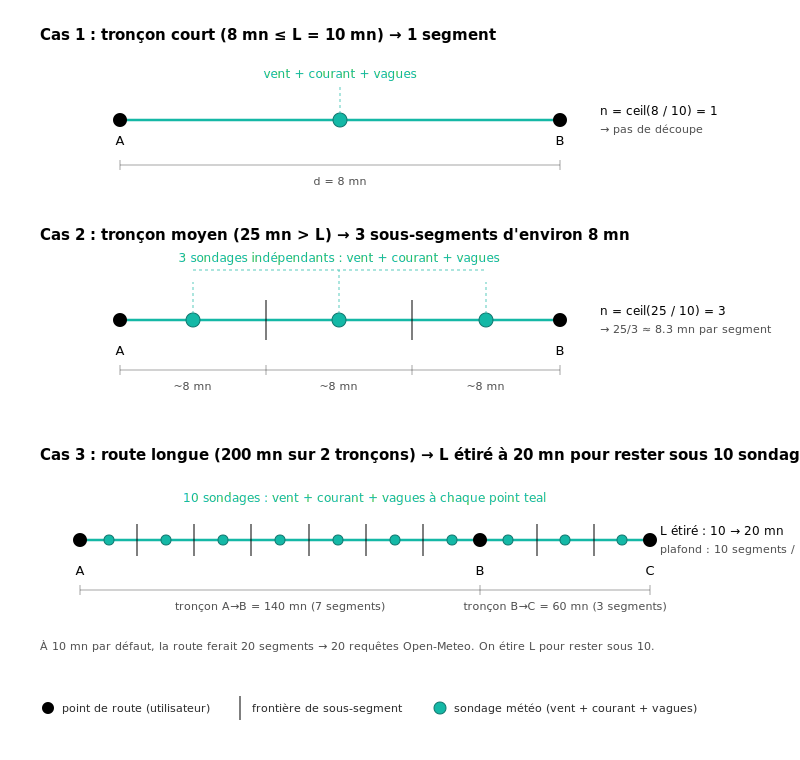

# Méthodologie

OpenWind est un planificateur de navigation à la voile open source pour les côtes françaises. Cette page explique d'où viennent les données, comment on estime un passage, et ce que l'outil ne sait volontairement pas faire.

## Sommaire

- [Les sources de données](#les-sources-de-données)
  - [Vent : cascade multi-modèles](#vent--cascade-multi-modèles)
  - [Vagues et niveau de la mer](#vagues-et-niveau-de-la-mer)
  - [Courants : produit SMOC global](#courants--produit-smoc-global)
  - [Marées et courants haute précision : atlas MARC](#marées-et-courants-haute-précision--atlas-marc)
- [Comment on estime un passage](#comment-on-estime-un-passage)
  - [1. Choix du voilier-type](#1-choix-du-voilier-type)
  - [2. Découpage de la route](#2-découpage-de-la-route)
  - [3. Vent au milieu de chaque sous-segment](#3-vent-au-milieu-de-chaque-sous-segment)
  - [4. Polaire, angle au vent et tactique au près](#4-polaire-angle-au-vent-et-tactique-au-près)
  - [5. Vitesse à l'eau (STW)](#5-vitesse-à-leau-stw--efficacité-et-réduction-par-les-vagues)
  - [6. Vitesse au sol (SOG), courant et durée](#6-vitesse-au-sol-sog-courant-et-durée)
- [Comment on déduit le courant en un point MARC](#comment-on-déduit-le-courant-en-un-point-marc)
- [Comment on note la complexité](#comment-on-note-la-complexité)
- [Les conventions du domaine](#les-conventions-du-domaine)
- [Ce qu'OpenWind ne fait pas](#ce-quopenwind-ne-fait-pas)
- [Sources et licences](#sources-et-licences)
- [Code et contributions](#code-et-contributions)

## Les sources de données

### Vent : cascade multi-modèles

Toutes les prévisions vent passent par **Open-Meteo Forecast API** (API = Application Programming Interface, interface de programmation), sans clé d'accès, avec une cascade par horizon :

- **AROME** (Application of Research to Operations at Mesoscale, Météo-France, 1.3 km), modèle haute résolution sur l'Atlantique français et la Méditerranée, environ 48 h. C'est lui qui capture les thermiques, les renforcements de cap et les vents locaux.
- **ICON-EU** (Icosahedral Nonhydrostatic, DWD = Deutscher Wetterdienst, le service météo allemand, 7 km) prend le relais jusqu'à 5 jours.
- **ECMWF IFS** (European Centre for Medium-Range Weather Forecasts, Integrated Forecasting System, 25 km) couvre l'horizon 10 jours.
- **GFS** (Global Forecast System, NOAA = National Oceanic and Atmospheric Administration, l'agence océanographique américaine, 25 km) sert de filet de sécurité jusqu'à 16 jours.

Vitesses toujours en nœuds. Directions toujours en convention météo **TWD** (True Wind Direction, "d'où vient le vent").

### Vagues et niveau de la mer

**Open-Meteo Marine API**, redistribution sans clé du modèle de vagues WaveWatch III (NOAA) et du modèle Copernicus pour le niveau de la mer :

- Hauteur, période et direction des vagues totales, plus la décomposition en vagues de vent et houle.
- Niveau de la mer relatif au MSL (Mean Sea Level), valeurs signées.

Suffisant pour la planification en eau libre et pour l'essentiel de la Méditerranée.

### Courants : produit SMOC global

Les courants proviennent du **produit SMOC** (Surface Merged Ocean Currents, courants de surface fusionnés) distribué par le Copernicus Marine Service, exposé via Open-Meteo. SMOC est une somme physique de trois composantes calculées à 1/12° de résolution (environ 8 km) :

- Le courant de marée prédit par modélisation harmonique.
- La circulation générale (issue du modèle global Mercator NEMO = Nucleus for European Modelling of the Ocean, à 1/12°, assimilé sur SST satellite (Sea Surface Temperature, température de surface de la mer), altimétrie et profileurs Argo).
- La dérive de Stokes induite par les vagues.

Référence académique : **Lellouche, J.-M. et al. (2018)**. *Recent updates to the Copernicus Marine Service global ocean monitoring and forecasting real-time 1/12° high-resolution system*. Ocean Science, 14, 1093 à 1126. [doi.org/10.5194/os-14-1093-2018](https://doi.org/10.5194/os-14-1093-2018)

Limite assumée : 8 km est suffisant au large mais reste trop grossier pour les passes étroites de l'Atlantique français, où l'on bascule sur les atlas MARC ci-dessous.

### Marées et courants haute précision : atlas MARC

Pour les passes critiques de la façade Atlantique, OpenWind s'appuie sur les **atlas harmoniques MARC** (Modélisation et Analyse pour la Recherche Côtière), produits par le programme PREVIMER (système opérationnel de prévisions côtières, Ifremer) en collaboration avec le SHOM (Service Hydrographique et Océanographique de la Marine). Résolutions : 250 m sur le Finistère, la Manche, le Sud Bretagne et l'Aquitaine, 700 m en Manche et Golfe de Gascogne, 2 km sur le large.

Ces atlas reconstruisent la marée par prédicteur Schureman/Cartwright à partir de 38 constituants harmoniques. La validation contre le marégraphe REFMAR (Réseau de Référence des Observations Marégraphiques) de Brest (2008, 8000+ observations horaires) donne un RMSE (Root Mean Square Error, erreur quadratique moyenne) de 14 cm et un r² de 0.99.

À chaque point de route, OpenWind applique la règle suivante :

```
si point ∈ emprise MARC valide  →  MARC (résolution la plus fine)
sinon                            →  Open-Meteo SMOC
```

Conséquence : précision native sur le Raz de Sein, le Goulet de Brest, le Raz Blanchard. Solution de repli globale et homogène ailleurs.

## Comment on estime un passage

Quand on demande "combien de temps pour aller de Marseille à Porquerolles avec un croiseur de 40 pieds", OpenWind procède en six temps.

### 1. Choix du voilier-type

On commence par associer le bateau à un **archétype** standard. Chaque archétype porte un polaire **ORC** (Offshore Racing Congress, l'organisme international de jauge) théorique, c'est-à-dire la vitesse du bateau pour chaque combinaison de **TWS** (True Wind Speed, vitesse réelle du vent) et **TWA** (True Wind Angle, angle entre le vent réel et le cap du bateau). OpenWind n'associe pas un modèle commercial à un archétype côté serveur : la correspondance se fait à partir des descriptions textuelles publiées pour chaque archétype.

Les polaires utilisées sont consultables ci-dessous (cliquez pour ouvrir). Chaque diagramme est tracé en demi-cercle (côté droit) : la vitesse du bateau est la distance au centre (en nœuds), l'angle au vent TWA est lu autour de la circonférence (0° = vent debout en haut, 90° = travers à droite, 180° = vent arrière en bas). Une courbe par valeur de TWS, du bleu clair (vent faible) au magenta (vent fort).

> **Note de lecture.** Les polaires ne descendent pas jusqu'à TWA = 0°. Par convention, les tableaux ORC ne définissent la vitesse qu'à partir de l'angle minimal de remontée du bateau (typiquement 40° à 45°). Dans la zone "interdite" plus serrée que cet angle, OpenWind ne lit pas un zéro dans la polaire (qui annulerait la vitesse de planification) : on bascule sur le calcul de louvoyage par projection VMG décrit à l'[étape 4 ci-dessous](#4-polaire-angle-au-vent-et-tactique-au-près). C'est pour cette raison que les courbes apparaissent ouvertes en haut.

<details>
<summary>Polaire — croiseur 20 pieds (Beneteau First 210, Catalina 22, Jeanneau Tonic 23, Jeanneau Sun 2000)</summary>

</details>

<details>
<summary>Polaire — croiseur 25 pieds (Beneteau First 25, Catalina 25, Jeanneau Sun Odyssey 24, Beneteau Oceanis 251)</summary>

</details>

<details>
<summary>Polaire — croiseur 30 pieds (Sun Odyssey 32, Bavaria 31, Beneteau Oceanis 31)</summary>

</details>

<details>
<summary>Polaire — croiseur 40 pieds (Sun Odyssey 410, Bavaria 41 Cruiser, Hanse 418)</summary>

</details>

<details>
<summary>Polaire — croiseur 50 pieds (Sun Odyssey 519, Bavaria C50, Hanse 508)</summary>

</details>

<details>
<summary>Polaire — racer-cruiser (J/122, Pogo 12.50, Solaris 40, Grand Soleil 43)</summary>

</details>

<details>
<summary>Polaire — catamaran 40 pieds (Lagoon 40, Bali 4.1, Fountaine Pajot Lucia 40)</summary>

</details>

Les fichiers source (JSON) sont dans le dépôt sous [`packages/data-adapters/src/openwind_data/routing/polars/`](https://github.com/qdonnars/open_wind/tree/main/packages/data-adapters/src/openwind_data/routing/polars). Chaque fichier contient le tableau brut TWS x TWA, la classe de performance et les exemples de bateaux.

### 2. Découpage de la route

La route est une polyligne de points de route (point de départ, escales, arrivée). Pour chaque **tronçon** (paire de points de route consécutifs) de longueur $d$, OpenWind calcule un nombre de sous-segments :

$$
n = \max\bigl(1,\ \lceil d / L \rceil\bigr)
$$

avec $L$ la longueur cible d'un sous-segment (10 milles par défaut, étirée jusqu'à 30 milles si la route entière dépasserait 10 points d'échantillonnage). Le tronçon est ensuite découpé en $n$ sous-segments d'égale longueur sur le grand cercle.

Conséquence concrète : un tronçon de 8 milles reste entier (1 segment, vent pris au milieu). Un tronçon de 25 milles est coupé en 3 segments d'environ 8 milles. Une route de 200 milles voit `L` étiré à 20 milles, pour ne pas saturer le serveur Open-Meteo.



### 3. Vent au milieu de chaque sous-segment

Pour chaque sous-segment, on estime d'abord un horaire de passage avec une vitesse heuristique de 6 nœuds. On récupère ensuite le vent **au milieu géographique** (point médian sur le grand cercle) et **au milieu temporel** de la fenêtre. Puis on calcule la vitesse réelle via le polaire interpolé.

C'est une approximation non itérative (un seul passage, pas d'itération jusqu'à convergence). Le biais est borné car la fenêtre vent qu'on rate est décalée de quelques heures au pire, ce qui reste dans la longueur de corrélation temporelle de la prévision.

### 4. Polaire, angle au vent et tactique au près

Pour chaque sous-segment, on calcule d'abord l'**angle au vent** TWA à partir de la direction du vent TWD et du cap du segment :

$$
\text{TWA} = \bigl|\,\bigl((\text{TWD} - \text{cap} + 540) \bmod 360\bigr) - 180\,\bigr|
$$

soit la valeur absolue de l'écart angulaire ramenée dans $[0,\ 180]$. Les polaires sont symétriques babord/tribord en V1 (pas de gestion explicite de l'amure).

On lit ensuite la vitesse polaire $v_{\text{polaire}} = \text{polar}(\text{TWS},\ \text{TWA})$ par interpolation bilinéaire dans le tableau JSON de l'archétype.

**Cas du près serré.** Si l'angle au vent demandé est plus serré que l'angle optimal de remontée du polaire (typiquement $\text{TWA} < 40\degree$ à $45\degree$), le bateau ne peut pas tenir directement le cap : il faut tirer des bords. OpenWind balaye TWA dans $[30\degree,\ 90\degree]$ pour trouver l'angle qui maximise le **VMG** (Velocity Made Good, projection de la vitesse polaire sur l'axe du vent : $v \cdot \cos(\text{TWA})$), puis projette la vitesse polaire à cet angle optimal sur le cap réel :

$$
v_{\text{eff}} = v_{\text{polaire}}(\text{TWA}_{\text{opt}}) \cdot \cos(\text{TWA}_{\text{opt}} - \text{TWA})
$$

Cette correction tient compte du surcroît de distance parcourue en louvoyant.

### 5. Vitesse à l'eau (STW) : efficacité et réduction par les vagues

La vitesse à l'eau (**STW** = Speed Through Water, vitesse par rapport à la masse d'eau) combine trois facteurs :

$$
\text{STW} = v_{\text{eff}} \cdot \eta \cdot k_{\text{vagues}}
$$

avec :

- **`η` (efficacité)** : facteur multiplicatif qui ramène le polaire ORC théorique à la voile réelle. **OpenWind utilise actuellement la valeur 0.75 par défaut, et cette valeur n'est pas modifiable depuis l'interface web.** Le paramètre existe côté serveur (un client expert peut le surcharger) mais aucun champ utilisateur ne l'expose pour l'instant. Valeurs de référence si on devait l'ajuster :
  - `0.85` régate (carène propre, voiles fraîches, équipage attentif)
  - `0.75` croisière (réglages standards, marges de confort, défaut OpenWind)
  - `0.65` croisière chargée en famille (eau, gasoil, équipement, carène salie)
  - `0.55` mer formée, carène négligée, équipage réduit

- **$k_{\text{vagues}}$** : facteur de réduction multiplicatif en présence de mer formée, paramétré par la hauteur significative $H_s$ et l'angle au vent :

$$
k_{\text{vagues}} = \max\!\left(0{,}5,\ 1 - 0{,}05 \cdot H_s^{1{,}75} \cdot \cos^2\!\left(\frac{\text{TWA}}{2}\right)\right)
$$

Trois mécanismes derrière cette équation :

1. **Loi de puissance $H_s^{1{,}75}$**. L'énergie portée par la houle croît comme $H_s^2$ mais la perte de vitesse sature (un bateau ne s'arrête pas linéairement) : un exposant $1{,}75$ calibré empiriquement reproduit bien les essais en mer.
2. **Pondération angulaire $\cos^2(\text{TWA}/2)$**. Vaut $1$ par mer de face ($\text{TWA} = 0$, impact maximal : tape, ralentissement franc), vaut $0$ par mer arrière ($\text{TWA} = 180\degree$, surf possible, impact négligeable).
3. **Plancher $0{,}5$**. Dans la pratique, sous des conditions extrêmes le navigateur réduit la voilure ou se met à la cape ; on ne descend pas en dessous de 50 % de la vitesse polaire.

Exemple numérique : $H_s = 2\text{ m}$ au près strict ($\text{TWA} = 40\degree$) donne $k_{\text{vagues}} = 1 - 0{,}05 \cdot 2^{1{,}75} \cdot \cos^2(20\degree) \approx 1 - 0{,}05 \cdot 3{,}36 \cdot 0{,}883 \approx 0{,}85$, soit environ 15 % de vitesse en moins.

### 6. Vitesse au sol (SOG), courant et durée

La vitesse au sol (**SOG** = Speed Over Ground, vitesse par rapport au fond) ajoute la projection du courant sur le cap :

$$
\text{SOG} = \text{STW} + V_{\text{courant}} \cdot \cos(\text{cap} - \theta_{\text{courant}})
$$

La direction du courant $\theta_{\text{courant}}$ est en convention océanographique ("vers où il porte"), donc un courant aligné avec le cap s'ajoute, un courant opposé se retranche. La SOG est plafonnée à un minimum de $0{,}5$ nœud pour éviter une durée infinie en cas de courant très contraire.

La durée du sous-segment vaut alors simplement :

$$
\text{durée} = \frac{\text{distance}_{\text{segment}}}{\text{SOG}}
$$

et la durée totale du passage est la somme des durées des sous-segments.

## Comment on déduit le courant en un point MARC

À l'intérieur d'une emprise MARC, les amplitudes et phases harmoniques des composantes **U** (est-ouest) et **V** (nord-sud) du courant sont stockées par cellule (250 m à 2 km selon l'atlas), une valeur par constituant astronomique. Pour évaluer le courant à un instant $t$ et une position donnée, OpenWind exécute le prédicteur Schureman/Cartwright séparément sur U et V :

$$
U(t) = U_0 + \sum_{i=1}^{N} H_i^U \cdot f_i(t) \cdot \cos\bigl(\sigma_i \cdot (t - t_0) + V_{0,i}(t_0) + u_i(t) - G_i^U\bigr)
$$

et symétriquement pour $V(t)$, avec :

- $H_i^{U/V}$ et $G_i^{U/V}$ : amplitude (m/s) et phase Greenwich (degrés) du constituant $i$ pour la composante considérée, lues dans la cellule MARC ;
- $\sigma_i$ : pulsation du constituant $i$ (degrés par heure, par exemple $\sigma_{M_2} = 28{,}9841$ °/h) ;
- $V_{0,i}(t_0)$ : argument astronomique d'équilibre au début du jour de prédiction, calculé à partir des longitudes astronomiques de Cartwright (1985) ;
- $f_i(t),\ u_i(t)$ : corrections nodales (variation lente sur 18,6 ans liées aux mouvements de la lune) ;
- $U_0,\ V_0$ : résiduel moyen non-tidal 2008-2009 inclus dans l'atlas (capture la circulation moyenne, mais pas la variabilité météo court-terme).

OpenWind reconstruit ainsi $U$ et $V$ pour chaque sondage, puis en déduit la **vitesse** et la **direction** du courant total :

$$
V_{\text{courant}} = \sqrt{U^2 + V^2}, \qquad \theta_{\text{courant}} = \operatorname{atan2}(U,\ V)
$$

Convention océanographique : $\theta_{\text{courant}}$ donne la direction "vers où" porte le courant, en degrés vrais (0° = Nord, 90° = Est). C'est cette valeur qui est ensuite projetée sur le cap du segment dans le calcul de SOG (étape 6).

Atlas utilisés : 38 constituants pour MARC PREVIMER (sous-ensemble du jeu standard de 60 constituants, dominé par M2, S2, N2, K2, K1, O1, P1 — la marée semi-diurne explique l'essentiel du signal en Atlantique français). Pour Brest, plus de 90 % de la variance du courant horizontal est portée par la composante tidale, ce qui justifie la précision native obtenue (RMSE 14 cm sur la hauteur, ratios comparables sur le courant).

## Comment on note la complexité

La complexité d'un passage est lue sur **deux axes indépendants** :

- **Vent** : TWS maximum sur les segments, classé en 5 paliers de "calme" à "très fort".
- **Mer** : **Hs** (hauteur significative, soit la moyenne du tiers supérieur des vagues observées sur une fenêtre donnée) maximum, classée en 5 paliers de "plate" à "très forte".

Le niveau du passage est `max(niveau_vent, niveau_mer)`. Pas de moyenne magique, pas de score composite. C'est l'axe le plus dur qui dicte la difficulté.

| Niveau | Étiquette  |
|--------|------------|
| 1      | facile     |
| 2      | modéré     |
| 3      | soutenu    |
| 4      | exigeant   |
| 5      | dangereux  |

Les avertissements (vent fort, mer forte, vent contre courant) sont rattachés à la portion de route concernée et restitués tels quels.

## Les conventions du domaine

Les directions sont mixtes par phénomène, c'est le standard métier :

- **Vent et houle** : "d'où" vient (TWD = True Wind Direction et TWA = True Wind Angle, convention météo).
- **Courant** : "vers où" porte (convention océanographique).

Le serveur normalise explicitement quand il compare vent et courant (détection de vent contre courant pour la complexité).

Côté niveaux de mer :

- En Méditerranée et au large, l'affichage reste en MSL.
- En zone MARC (Atlantique), on calcule un **zéro hydrographique** local (minimum de prédiction sur 19 ans par cellule) pour s'aligner sur la convention française.

## Ce qu'OpenWind ne fait pas

Par choix de conception :

- **Pas de routeur d'optimisation**. OpenWind ne cherche pas la "meilleure route" ni la "meilleure fenêtre". Il restitue les données brutes ; l'interprétation revient au marin.
- **Pas un substitut à un atlas SHOM ou à une carte papier** dans une passe étroite. C'est un outil de planification, pas de pilotage.

Limites assumées des données :

- **MARC ne capture que la marée et un résiduel moyen 2008-2009**, sur les passes critiques de l'Atlantique français (Manche, Finistère, Sud Bretagne, Aquitaine) où les marnages dépassent souvent 5 m et les courants peuvent excéder 5 nœuds dans les passes étroites. C'est cette donnée de marée haute précision qui justifie la cascade MARC → SMOC. Une surcote de tempête (composante atmosphérique non périodique) ne sera pas modélisée.
- **Open-Meteo SMOC à 8 km** est insuffisant dans les passes étroites de l'Atlantique. C'est explicitement signalé en sortie.
- **Atlas MARC figés en 2013**. Les amplitudes harmoniques sont stables dans le temps (variation millimétrique sur 10 ans), mais aucune actualisation n'est faite.

## Sources et licences

| Source                        | Licence                                              | Citation                                                        |
|-------------------------------|------------------------------------------------------|-----------------------------------------------------------------|
| Open-Meteo Forecast / Marine  | CC BY 4.0                                            | open-meteo.com                                                  |
| AROME (via Open-Meteo)        | Open Etalab 2.0                                      | Météo-France                                                    |
| Atlas MARC PREVIMER           | Engagement non-redistribution NetCDF brut            | Pineau-Guillou (2013)                                           |
| Marégraphes REFMAR            | Libre, source obligatoire                            | REFMAR, dx.doi.org/10.17183/REFMAR#RONIM                        |

Référence académique pour MARC : Pineau-Guillou Lucia (2013). PREVIMER, Validation des atlas de composantes harmoniques de hauteurs et courants de marée. Rapport Ifremer, 89 p. [archimer.ifremer.fr/doc/00157/26801](http://archimer.ifremer.fr/doc/00157/26801/)

## Code et contributions

OpenWind est intégralement open source. Le code, les polaires, le prédicteur harmonique et la cascade de routage sont sur le dépôt GitHub. Les contributions sont bienvenues, en particulier sur les polaires de nouveaux archétypes et sur l'extension de la couverture MARC.
